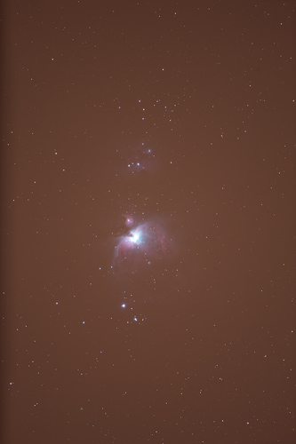
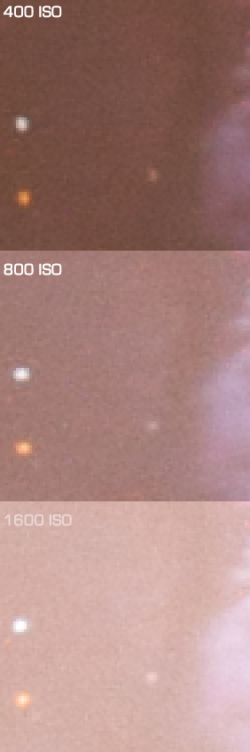
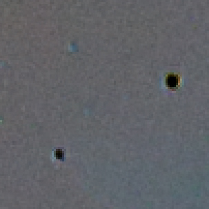

There have been a lot of reports of the 5D's trouble with bright point lights. I recently updated to the new firmware (version 1.0.7) and took some test shots with the 5D Mark II and a Takahashi FS102 refractor. I also wanted to test out the sensitivity at various ISO values. All these pictures were taken from my driveway on a day with fairly bad seeing and transparency. I got out a ladder and threw a blanket over one of the street lights but it didn't help much with the sky glow.

### Raw Images

All the close up images come from a tiny portion of three of these four images, each 160 second exposures. The 6400 ISO image was so blown out I couldn't use any of it.

| ISO  | Image                                       |
| ---- | ------------------------------------------- |
| 400  |  |
| 600  |  |
| 1600 |  |
| 6400 |  |

### Noise Results

The difference in noise between the 400 ISO image and the 1600 ISO image is barely noticable.

### 'Black Dot' Artifacts

I created a difference image to compare the saturated stars at 400 ISO and at 1600 ISO and I don't see any evidence of black dots or white, median filtered dots. It could be that this only happens at very high ISO levels. This is a releif because I don't plan on imaging above 1600 ISO with this camera.

### Process

These are straight out of the camera with no manual processing.

1. Captured in full resolution RAW format
1. Converted to 16bit PSD with Aperture (no adjustments)
1. Scaled and cropped in Photoshop CS3
1. Exported to JPG in Photoshop CS3

The only chance for change would be Aperture's RAW handling, which probably does do some noise reduction, and Photoshop's JPG compression.

Download the 800 ISO Raw image here: [IMG_0120.CRW](IMG_0120.CR2)

