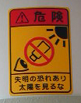
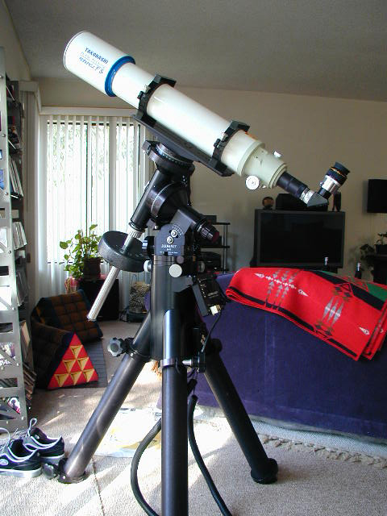
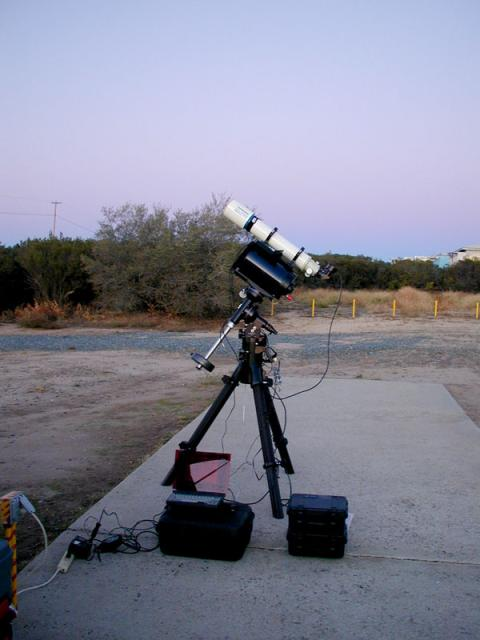

### Takahashi FS102 Refractor

This Apochromatic telescope provides very sharp images with no color fringed stars. When reduced to F/5.9 you get about 3 degrees of coverage in the sky. I prefer to take pictures of large, wide field objects and this is just about the right focal length for those objects. I also use the extremely well made Takahashi camera angle adjuster to make framing easy.

I use a collection of camera bodies and lenses along with the telescope tube for pictures. Many objects are too large to frame in the telescope and a normal 100mm to 300mm telephoto lense will frame them perfectly.

The earth rotates and you need some way of counter-rotating so the stars don't make trails in the long exposures. I use the Losmandy G11 mount which has been modified slightly. Even the best mount and alignment doesn't give the required precision so I use an STV auto-guider. This autoguider does all the work for you and doesn't require you to bring a computer along.

### Losmandy G11 Mount

The Losmandy G11 is a well made german equatorial mount. I've made some modifications to it to help with tracking (and because it was fun to do!) but stock it does a very good job. Losmandy makes a lot of adapters so it's easy to connect any tube or tubes.

See my article on upgrading the bearings at [G11 Bearing Upgrade]()

### Cameras and Lenses

I have multiple cameras that I've used over the last 10 years including film SLRs, cooled astrophotography CCDs and standard digital SLRs. These are the cameras that I still use for astrophotography.

#### Pentax K-1000 Film Body

The Pentax is a trusy film body that I used with E200 slide film and other various negative films. It's sturdy and doesn't have any electronic parts to break.

| Lens             | Field Size        |
| ---------------- | ----------------- |
| Pentax 35mm f/4  | 58&deg; X 39&deg; |
| Pentax 135mm f/4 | 15&deg; X 10&deg; |

#### Canon 10D Body

The 10D is a great DSLR that I've only recently started using for astrophotography. It isn't very sensitive to red light because of the filtering and it's fairly noisey, but it still does an amazing job with long exposures.

| Lens                             | Field Size          |
| -------------------------------- | ------------------- |
| Canon 300 f/4 L                  | 4.3&deg; X 2.9&deg; |
| Takahashi FS-102 F/8             | 1.6&deg; X 1.1&deg; |
| Takahashi FS-102 F/5.9 (reduced) | 2.1&deg; X 1.4&deg; |

#### Canon 5D Mark II Body

The Canon 5D Mark II is a monster 21 megapixel DSLR. It is extremely sensitive to light and has very low noise, even for a non-cooled camera.

| Lens                             | Field Size          |
| -------------------------------- | ------------------- |
| Canon 300 f/4 L                  | 6.9&deg; X 4.6&deg; |
| Takahashi FS-102 F/8             | 2.5&deg; X 1.7&deg; |
| Takahashi FS-102 F/5.9 (reduced) | 3.3&deg; X 2.2&deg; |

### Eyepieces

I don't do a lot of visual observing, but when I do it's nice to have a range of high-power and wide-field eyepieces.

| Objective                    | Mag | Field Size |
| ---------------------------- | --- | ---------- |
| 8.8mm Meade Ultra Wide Angle | 93X | 0.9&deg;   |
| 26mm Meade Super Plossl      | 32X | 1.63&deg;  |
| 40mm Meade Super Plossl      | 20X | 2.2&deg;   |

## Astrophoto setup

