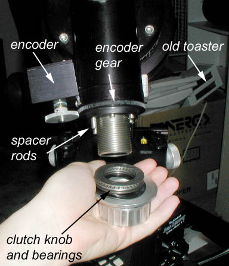
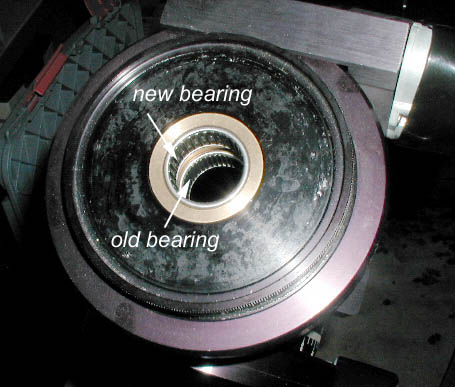
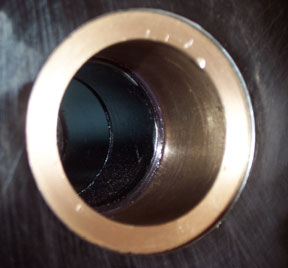
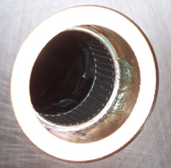
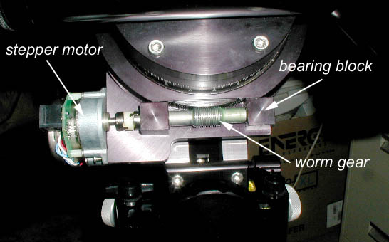
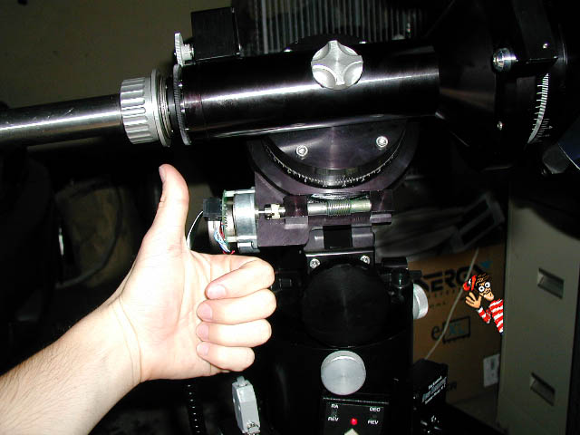

This is a tutorial on replacing the bearings on the Losmandy G11 telescope mount.  This may or may not improve the tracking ability.  It's kind of fun to do anyway.

The Losmandy G11 mount is a great piece of hardware. However, the included bearings seem to fall short when compared to the rest of the mount. Unfortunately these bearings can play a large role in the tracking accuracy of the mount. What follows is a description of how to augment the declination shaft bearing and replace the worm gear bearings in the G11 mount. (Note: some of this may also apply to the G8).

### Stuff you need

You will need to buy the replacement bearings. I purchased them online from McMaster-Carr.

* (4) Mini-Precision SS Ball Bearings - ABEC-5 Plain Shielded, .25" ID, .625" OD, .196" WD part# 57155K58. Notes: the stainless steel quality used in these bearings is not high as the 5908K11 bearings. However, the 57155K58 bearings are shielded much better and are much higher precision. 
* (2) 3/4" wide bearings part# 5905K29

You will also need a set of allen wrenches.

### Adding a third DEC thrust bearing

Remove any telescope tubes, the counterweight and counterweight shaft from the mount. Unscrew the DEC clutch knob and remove it completely. Be careful to keep the washers and bearings from separating. (The correct order from outside in is: wavy washer, washer, bearing, washer). If you have encoders loosen the set screw on the encoder gear and remove it and it's washers and bearings. Be careful not to lose any spacer rods.

Now you can remove the entire DEC rod by lifting gently on the mounting place and sliding it out of the shaft. Look down the shaft and you will see two sets of bearings. Run your fingers across the surface and make sure they roll smoothly. Now may be a good time to clean and re-lube the existing bearings. If all looks well then you can proceed with adding the third bearing. Just insert it at the top of the shaft. You may need to tap it in lightly and evenly with a mallet (I did). Note: some people placed this extra bearing at the clutch-knob end of the shaft. Update: I have had at least one report of these bearings not fitting even when a machine shop press is used. I can't really explain this since they fit in mine, but be warned: if it looks really tight you may want to hold off on this part of the project.

Replace the DEC rod and reassemble the encoder and clutch assemblies in the opposite order you removed them. This method works for the RA shaft bearings as well.

### Note for owners of older G11 mounts

When Topher Allen took apart his G11 (circa 1996) and found an interesting difference from my G11 (circa 1999). His RA shaft had a "shelf" which prevented a second bearing from fitting in the shaft. The following two images detail the shaft with and without the bearing in place. Note that there is not enough room for a second bearing.

Older G11 with bearing removed. Note the "shelf".

Older G11 with bearing in place. Note the lack of space for a second bearing.

### Replacing the worm bearings

You can replace the counterweight shaft, but only replace the counterweight and telescope tube if you are feeling brave. First unscrew and remove the motors. Remove the worm cover by loosening the tiny allen bolts on the front. Remove the worm gear and bearing blocks by unscrewing the two large allen bolts on the rear of the worm plate.

Loosen the set screw on the motor mating and remove the bearing blocks from the worm. If you're lucky the bearings will pop out when you remove the bearing blocks from the worm gear. You may need to pull the bearings out of the bearing blocks by fashioning some type of hook and pulling. They can be stubborn.

Insert the new bearings in the bearing blocks and replace the worm and motor mating. Bolt it back on the mount tightly on the motor side and loosely on the other side. You now need to adjust the worm so it has little or no backlash but doesn't bind with the RA gear. Squeeze the bearing blocks together and lightly press the worm gear into the RA gear. Tighten the bolt with your other hand and try turning the worm. If you feel any snags you have applied too much pressure to the worm. You should notice how much smoother and consistent the worm feels.

Do the same on the DEC worm gear as well.

If your mount didn't explode while you were working on it then congratulations, give yourself a pat on the back! Hopefully your mount will track better and have less slop when moving.

As always, any suggestions are appreciated.

### Resources

* [G11 Tuning](http://www.astro.uni-bonn.de/~mischa/mounts/g11_tuning.html)

