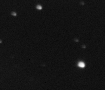
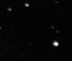
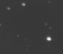

I'm evaluating MaxIm DL and PixInsight at the same time because I only want to purchase one image processing package.  The first significant obstacle I've come across is that PixInsight doesn't seem to scale dark frames very well.  I've run the exact same calibration process on the same image and I get completely different results with the two packages.  I'm testing using a 600 second raw image, a 300 second master dark frame, and a master bias frame.

### Math

*Please see [this page](http://www.astrophoto.net/calibration.htm) for the basics of image calibration*

\begin{equation}
   I_{calibrated}=I_{raw} - (K_{scale}*(I_{dark}-I_{bias}) + I_{bias})
\end{equation}

### Source Images

Here are the calibration frames used for the testing.

| Original          | Dark                               | Bias                          |
| ----------------- | ---------------------------------- | ----------------------------- |
|  |  |  |

### Results

And the results after running these frames through various tools and processes.

| MaxIm DL                 | PixInsight                         | PixInsightoptimized | PixInsightpixel math |
| ------------------------ | ---------------------------------- | ------------------------------ | ------------------------------ |
|  |  |   |              |

*Note: all images have been cropped and stretched for web display*

### Notes

Running the hot pixel at `[29,59]` through the equation we end up with

\begin{equation}
    0.2360-(2*(0.2642-0.0179)+0.0179) = -0.0282
\end{equation}

This value is probably clamped to `0` which explains the black pixel in the PixelMath image.

PixInsight's optimized calibration module is doing almost nothing to the image.  However, the value changes by about 0.53% (from `K=23.6%` to `K=23.07%`)

MaxIm DL does an excellent job of scaling the dark frame.

PixInsight's non-optimized calibration does not seem to add a pedestal which results in lots of clipping at the low end
