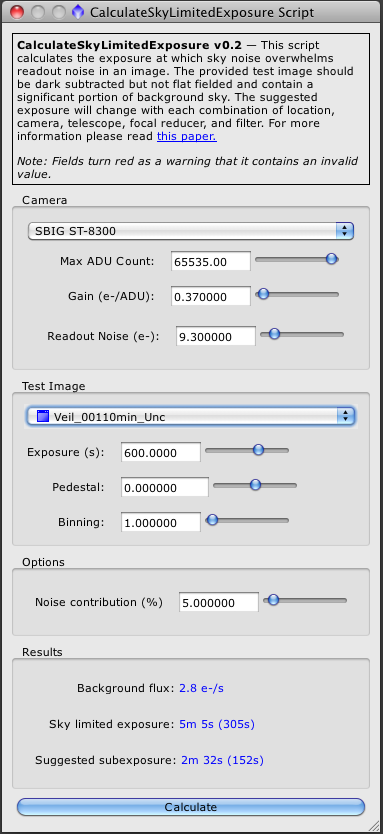

One of the fun technical challenges in astrophotography is the meticulous attention to detail that you must apply to every step. One of these details is correctly balancing the desire to take long exposures to minimize the effects of readout noise and the desire to take lots of short exposures to minimize the wasted time of an exposure with a random defect such as cosmic ray strikes or tracking errors. Additionally, multiple exposures lets you use advanced pixel rejection techniques that require many images to function well.

It turns out that you can derive an equation that takes the guesswork out of finding this balance. Until now you needed to manually collect various kinds of information from test images and hardware documentation and plug them into a formula by hand. This [paper](http://www.hiddenloft.com/notes/SubExposures.pdf) does an excellent job explaining the ideas and formulas behind the process.

I've reduced some of the grunt work by writing a small script for [PixInsight](http://pixinsight.com) that takes an image (loaded with FITS information) as input and spits out a suggested sub-exposure length. It's important to use a test image that <strong>has</strong> been dark subtracted but <strong>has not</strong> been flat fielded.If you have lots of vignetting and you want a very accurate measurement you should extract small images from the edge of the field where the falloff is greatest and use that as your test image.

<strong>Add pixinsight.cerebiggum.com to your PixInsight update list to download the most recent version.</strong>

[CalculateSkyLimitedExposure](https://github.com/seanhoughton/CalculateSkyLimitedExposure)
