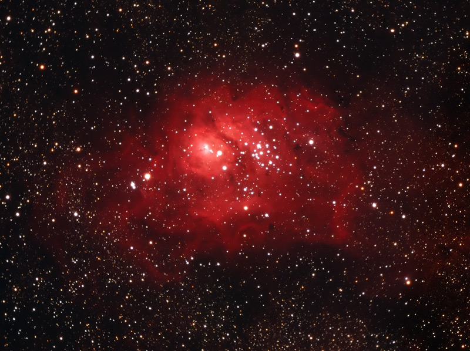

After scanning in some of my old slides I decided to stack a couple of M8. This image is a total of 1.5 hours of exposure from 2001.

The Lagoon nebula is a bright nebula in the summer sky. It's easy to see with the naked eye if the sky is dark enough and its brightness makes it a relatively easy target for astrophotography. However, any tiny technical mistake shows up with exposures this long. If you look closely you can see the stars around the edge of the field are curving around. This is called field rotation and it happens if your telescope isn't perfectly aligned with the earths rotational axis.

