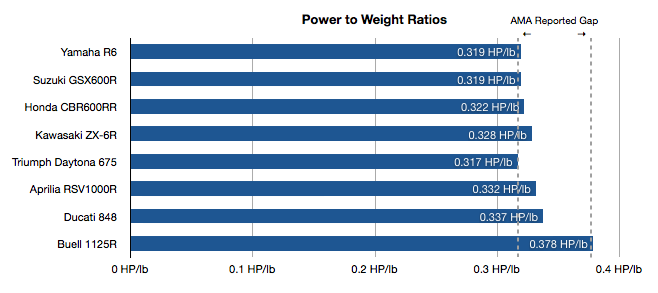

The AMA is responsible for creating rules for the motorcycle racing series that ensure fair competition between motorcycles of different manufacturers and construction. The AMA Sport Bike series mixes motorcycles with 2, 3 and 4 cylinders from many manufacturers. Lately, the underdogs (Buel) have been doing really well and people are starting to suspect that the rules are slanted in their favor.

The AMA recently dyno tested all the bikes and released the minimum and maximum weight-to-power ratios. The guys at <a href="http://www.asphaltandrubber.com/racing/ama-checks-powertoweight-ratio-pro-daytona-sportbikes/">Asphalt and Rubber</a> combined those numbers with what we know about the stock machines. The result is a pretty clear picture of where the bikes end up on the spectrum.

I liked the Asphalt and Rubber article but I wanted a more visual representation of the information. Converting the original tables into a basic bar chart with indicators of where the AMA has claimed the range sits made it much easier for me to understand what the data was saying as well as how overpowered the Buel is.

I modified the original article's assumed horsepower increase over stock from 15% to 12% which makes the power to weight ratio gap values line up perfectly with the estimated power of each bike. Clearly the Buel is overpowered when compared to the other machines.

I just heard that the AMA has increased the minimum weight requirement for the Buels by 12 lbs. This reduces its power to weight ratio from 0.378 HP/lb to 0.367 HP/lb. This change brings it closer to the other models but it's still overpowered.

One important things to remember is that the peak horsepower of a motorcycle is not the only factor in how well it performs on the racetrack. The shape of the power curve, the handling characteristics and other factors can be just as important.

<a href="{{site.url_root}}/media/2009/05/superbike-worksheet.numbers">Spreadsheet (Apple Numbers format)</a>
