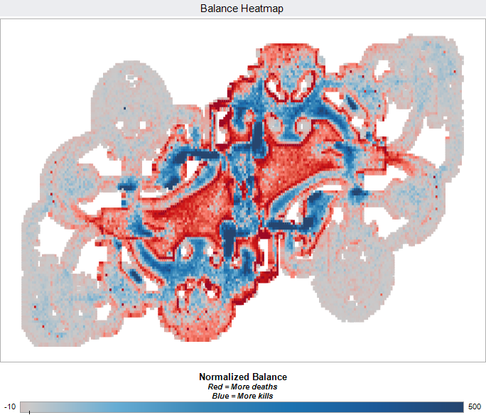
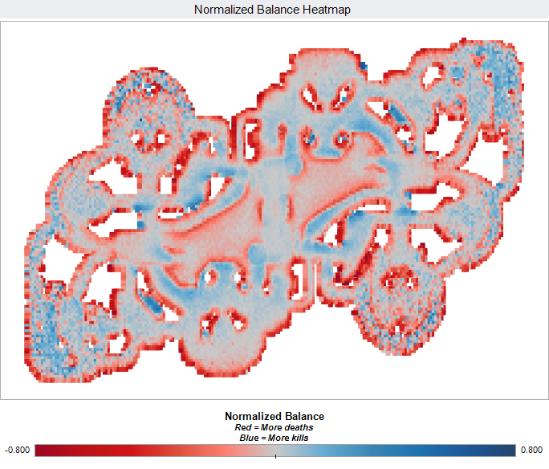

Heatmaps are an excellent tool for visualizing data with a two dimensional spatial component. They are frequently used to map out player deaths in shooter games. The most common heatmaps use the location of the victim and aggregate the number of kills as the visualized measure. However, this simple metric doesn't tell the whole story. With a few simple tweaks we can build balance and flow maps, which can be useful tools for understanding the way players use the map.

This article uses data from the Molten map in Transformers: War for Cybertron.  I've annotated some interesting features in the following image, but playing the map is probably the best way to get a feel for the layout.


### Death Heatmaps

Let's start with a basic "Death" heatmap. This visualization is fairly easy to build.  Each kill is binned based on the victim's location and the number of records in each bin is measured. Adding a thermal colormap makes it easy to differentiate the values.


We can clearly see that there is a lot of action on the bridge the center of the map. The deaths are clustered here, probably because the bridge acts as an elevated choke point. Please disregard the various clusters of four hot pixels near the edges, these are spawn-points and are subject to unusually high kill and death counts.

### Kill Heatmaps

Kill heatmaps are nearly identical to death heatmaps, the only difference being that they aggregate the kills based on the location of the killer instead of the victim.


### Balance Heatmaps

Although the kill and death heatmaps are very similar, if you look closely you will see areas that differ. This indicates that some areas of the map do not have a perfect kill:death balance. If we subtract the the Death Heatmap totals from the Kill Heatmap totals we get a Balance Heatmap. Areas with positive values (i.e. more kills than deaths) represent effective killing spots, whereas areas with negative values (i.e. more deaths than kills) should probably be avoided.



This view of the data does a much better job at highlighting the dangerous places in the map.  We can see the centers of hallways are much safer than the large, open areas in the center of the map.  Also, walls in general seem to be very dangerous - probably because your movement is restricted and it's much easier to get hit with splash damage. The ridges surrounding the low areas in the center of the map illustrate where balance heatmaps differ significantly from kill heatmaps - the kill heatmaps don't highlight them, but the balance maps do.

The raw balance exaggerates areas containing many samples.  This produces a nice saturation boost in high-activity areas.  However, the data can be normalized to even out the tones.

### Normalized Balance Heatmaps

The "normalization" happens within each cell.  The raw balance is divided by the number of samples in each cell.  The value is now in the range [-1,1] and this gives the entire heatmap a more consistent saturation.  Unfortunately the lack of data in the outer areas introduces some noise, but I think it's an acceptable artifact.



### Gradient Maps

Using the same kill data we can perform another aggregation - the kill gradient for each cell.  This is simply the average direction of each kill in each cell.  The result is a vector field representing the most common direction of each kill.  A long vectors indicates a very advantageous firing direction. If we introduce some particles to trace the field some interesting patterns start to emerge.

[](flowmap.html)

The flowlines trace good "run and gun" paths to try.  This technique is easy to adapt to victim data as well, with the flowlines tracing out the safest retreat paths.

### Future Exploration and Limitations

These visualizations are a good starting point for understanding the way people are playing the map. The flow data is ripe for more analysis. One option is to build an kill adjacency matrix for each cell and visualize it using a mouse probe in Processing.  Combining the balance and flow data may also yield some interesting insights. Filtering the data by weapon type may illustrate differing strategies.

Like any technique there are some limitations to be aware of.  First and foremost, balance heatmaps require a lot of data and are therefore not very practical as a development tool.  Reducing the size of each bin will reduce the noise level, but each bin requires at least a few hundred samples to be useful.  These images were made with millions of rows (a volume of data that internal play-testing is unlikely to produce) and they still exhibit some noise in the outer areas of the map.

Another limitation is the projection of 3D data into a 2D plane. For example, the center of this map contains a bridge and the flattening distorts the values.  Jim Blackhurst [recently posted](http://jimblackhurst.com/wp/?p=213) an article about his experiences rendering this type of data as 3D point clouds.

Finally, these techniques require that you have location information for both the killer and the victim for each kill.  This will increase the size of the telemetry payload. Kill tables can grow very large and if bandwidth or disk space is a problem this may be too much additional information.

### Technical Details

The article uses data from Transformers: War for Cybertron. The dataset is composed of 30 million rows collected from public Team Deathmatch games in the Molten map. All the data is stored in an [InfoBright/MySQL database](http://www.infobright.com). The heatmaps were generated in [Tableau](http://www.tableausoftware.com). The flow visualization was done in [Processing](http://processing.org).

Most of the SQL queries use the following structure.  The ```ROUND``` and ```GROUP BY``` statements are very useful tools for building this type of visualization.  For example:

```sql
SELECT x,y,SUM(kills) AS counter FROM
    (SELECT ROUND(x/100)*100 AS x,ROUND(y/100)*100 AS y,1 AS kills FROM kill_table)
GROUP BY x,y
```

Anyone who wants to play this map can download the free multiplayer demo in the [Xbox LIVE marketplace](http://marketplace.xbox.com/en-US/Product/Transformers-War-for-Cybertron-Multiplayer-Demo/00000000-0000-400d-80df-000141568885). Maybe this post will help your score!

In future posts I'll discuss alternative methods of rendering heatmaps and the web-based tools in place at [High Moon Studios](http://www.highmoonstudios.com) for creating them.
