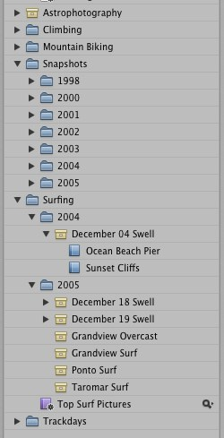

I've tried a couple Aperture folder hierarchies and this is the one that seems to work the best for me.

Initially I imported my entire image collection into one library with subfolders for the date.  I quickly realized that I was going to hit the 10,000 image-per-project limit.  I've now decided on a different organization that has worked really well.  The basic idea is major category folders at the top, year folders under that and all projects below that.  For example:

Depending on the shoot I take between 30 and 500 images.  Each shoot goes into a single project which is placed in the correct major category and year.  I take a <strong>lot</strong> of photographs and so far this has made it really easy to locate the images I need.  Now, I'm not a fancy-pants professional, so your mileage may vary.

