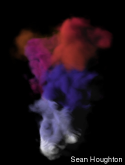
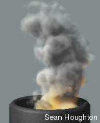
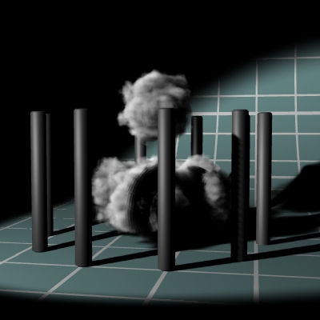

Plume is a volumtric renderer I have been working on for a while on my free time ( which explains the lag ). It is a pixel filter for Lightwave which originated as a stand alone Ray Marching program I wrote. I have ported it to lightwave and what follows are samle renderings. This is just the start of the project and I plan to have some downloadable beta versions soon. I have a Plume shader also which receives gas shadows for seamless integration into Lightwave renderings.

This image demonstrates Plume's ability to use ParticleStorm data. Notice the mixing of colors between particles and the change from dense gas at the bottom to thin gas at the top. Currently, size, color, alpha, and age are supported parameters.

Plume with multiple light source illumination. Any number of light sources can be used, although more lights means slower renders.

Lightwave rendered with Plume applied to four particles in the center of the poles. Notice the shadows being cast by Plume gas onto the floor, and the shadows being cast by the poles onto the gas. Plume gas is rendered seamlessly with Lightwave renderings when the shadow shader is used on all surfaces.

