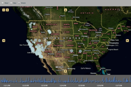

*Update: the USGS has changed their service and this app no longer works.  Plus, I lost the source code after a hard drive crash. Remember - back up your data!*

Flash, and Flex in particular, has a solid set of tools available ata visualization.  When I found that the USGS provided realtime earthquake data as csv files I couldn't resist building a viewer.  It's based on [a traffic map by Nathan at Flowing Data](http://flowingdata.com/2008/09/03/how-to-create-a-real-time-web-traffic-map-for-your-site)

### What is It

The map polls data from the USGS's realtime earthquake data stream. The resulting data is presented as a map with dots representing earthquakes and a 'seismograph' style chart below.  You can choose to view data from the previous week, current day or just the last hour.

### How it's Built

The viewer is built completely in ActionScript using the Flex toolkit and the Flex Builder development environment.  The scrolling maps are all done with Modest Maps.  There is some minor glue code to pull the data from the USGS web page and csvlib is used to parse the results.

There are still a lot of user interaction features that would be nice to have, but the basics are all there.

- [Modest Maps](http://modestmaps.com)
- [USGS Data Feeds](http://earthquake.usgs.gov/eqcenter/catalogs)
- [Adobe Flex SDK](http://www.adobe.com/products/flex)
- [csvlib](http://code.google.com/p/csvlib)

### Why not use Google Maps API?

I really don't like the look of google maps to be honest.  I think the markers are ugly and there isn't much choice for map style.  One of the biggest issues is that the code has to all be written in JavaScript which is not nearly as good when compared to ActionScript 3.  ModestMaps makes it easy to use Google's tile servers for the maps anyway, so there isn't much reason to write it all in JavaScript.

