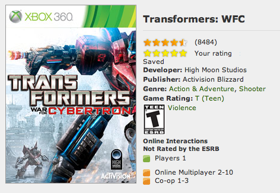

After almost two years of work the Transformers: War for Cybertron game is finally done and the demo is available for download.  I had to rewrite some of the code in our data collection system* because so many people are playing!

So far the reception has been really good.  The demo currently has a 4.5 / 5 star rating and the forums seem to be filled with positive comments.

 
*<em>We collect more than one gigabyte of data every day about how people are playing the game.  Things like weapon usage, character setup, and game search metrics.  This helps us plan for title updates and future projects. 
</em>

