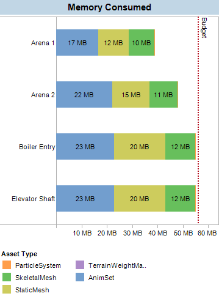
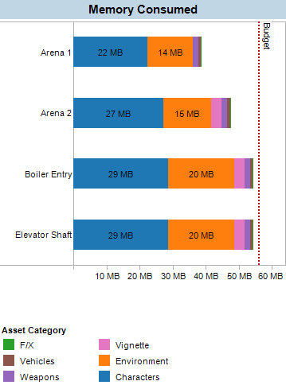
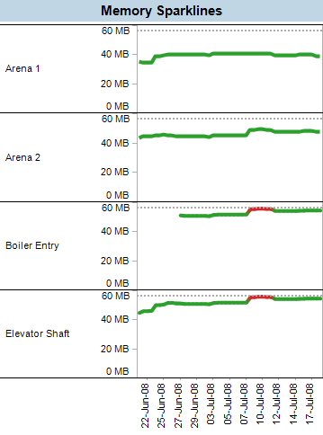
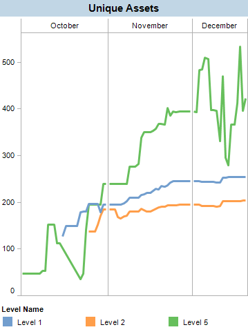
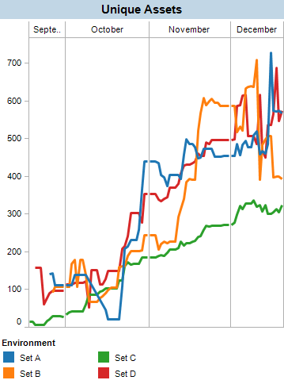
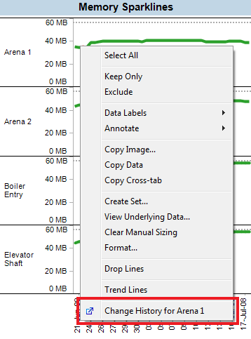
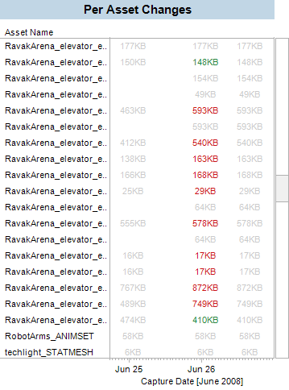
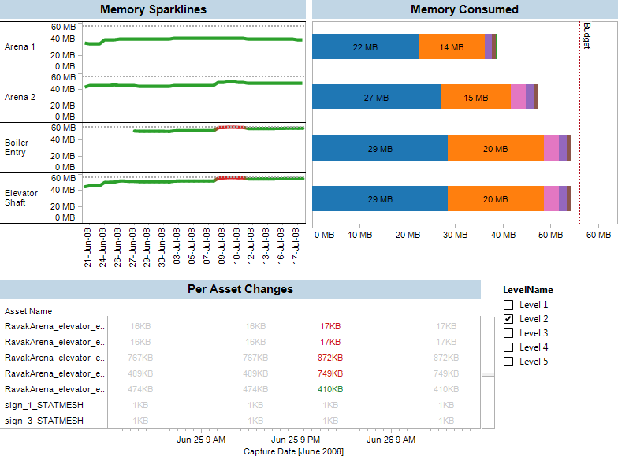

[](http://www.highmoonstudios.com)

Console video games run on memory restricted environments and even with half a gigabyte of space it runs out quickly. It's easy to know when you're out of memory, what we want to know is exactly what approach to take to fix the problem. With all the information available the challenge is presenting the information in a way that gives clear indication of problems while providing enough low-level detail to zero in on individual assets. Additionally, we would like to be able to predict problems ahead of time. This article describes the approach we've taken at High Moon Studios to make the state of memory usage visible to the team and provide tools for detailed analysis.

### Organizing the Chaos

In a typical game map there are tens of thousands of objects and each one references a shared pool consisting of thousands of assets. These assets are things like images, 3D models, pre-calculated lighting and animation. To complicate the situation these assets can be streamed in and out of memory with commands issued by the map layout designers.

To organize this situation the map can be organized into discrete state which we'll call a 'checkpoint'. Each checkpoint is an exhaustive set of assets that are to be loaded at that state. When a player's avatar enters an area in the map all the assets in the previous checkpoint are unloaded and all the assets in the new checkpoint are loaded. The map layout designers are responsible for creating checkpoints that neverexceedthe memory budget.

### Building Useful Views into the Data

We use an automated build server to capture all the information about each checkpoint and insert it into a database each night. Once the data in a easy-to-query format such as a relational database the challenge is presenting it.For these examples I've used [Tableau](http://www.tableausoftware.com) but similar results could be created with the graphing components of [Adobe Flex](http://www.adobe.com/products/flex) and some elbow grease. Both tools can connect directly to a SQL database and provide live, up-to-date information.

*Note: stay tuned for a futurepost with detailed information about the pipeline for extracting and storing these metrics.*

To begin with we need to ask ourselves what questions need to be answered, i.e. what problems are we trying to solve?

- Are we over budget?
- Are we **going** to be over budget?
- Why are we over budget?
- Who do I blame? This is easier said than done!


### Total Memory Consumption

Total memory consumption for each checkpoint is a core piece of information we want to make visible.  Developers need to know where each map stands without having to run through the entire game using a monitoring tool just to check on the state of the game. If we automate the metrics collection and storage we can look at the state of the entire game at any time.

The first, and most useful piece of information is the total memory consumption. If this goes above the budget we have a problem.

[](simplebars.png)

The total consumed memory chart is useful because we can see how close to the budget we are. However, it doesn't provide much information about how to fix the problem. We need more information if we're going to quickly identify what needs to be addressed first.

### Asset Type Breakdown

Asset types are core resource types. Our next chart tries to provide insight by slicing the bars by asset type.



The asset type breakdown is especially useful in the optimization phase. If 90% of your memory is used by animation data it doesn't make much sense to spend time optimizing the 3d mesh data. However, most art teams are grouped at a higher level and it isn't immediately obvious who should be doing the work. For example, both world geometry and characters use meshes. If a level is over budget and the mesh block looks too large we need to know who is responsible.

### Team Breakdown

Asset types don't always directly map to teams and we need some way of differentiating an environment mesh from a character mesh. There are many ways to do this including naming conventions and metadata tagging. High Moon Studios uses a simple naming convention approach. Assets are always grouped into packages and the name of the package indicates its purpose. For example, packages starting with `PROP` or `ENV` are considered environment assets while assets in packages named `CHR` are character assets. We can use SQL expressions or Tableau'scalculated fieldsto do this for us.

```sql
IF FIND([PackageName], "PROP")!=0 THEN "Environment"
ELSEIF FIND([PackageName], "ENV")!=0 THEN "Environment"
ELSEIF FIND([PackageName], "CHR")!=0 THEN "Characters"
ELSEIF FIND([PackageName], "WEP")!= THEN "Weapons"
ELSEIF FIND([PackageName], "UI")!= THEN "UI"
...
ELSE "Other"
END
```

This is a much more natural way to slice the data than the Asset Type view we just saw. Non-technical people can look at the reports and quikly know which team to talk to if a map starts approaching the budget.



This chart gives us a high level view into where memory is being uses in the game while still being simple enough to be used by everyone on the team.

### Sparklines

Knowing the current state of consumption is essential but having historical information gives context. A sparkline will let us see trends as well as jumps in memory consumption. These jumps are especially important to catch because they can be clues into art mistakes or poor planning. Some jumps can be expected, for example, in the days before a milestone. However, a large jump in the middle of the week might indicate an accidental code change that bloats the size of assets.



Note that the budget is included as a dashed line and any days where the budget was exceeded are colored red. The simple design and clear coloring make it clear when there is a problem. In this case, which is real production data, it was fixed within a day of showing up on the report.

### Measuring Asset Reuse

One of the things we learned from producing The Boune Conspiracy is that reusing artwork is extremely important.  Bourne was set in multiple countries and each setting required its own unique content. This had a tremendous cost in many areas including manpower required, runtime memory footprint and even DVD space.  We want to ensure assets are being reused.  The more assets a map requires the more time it will take to construct, maintain, optimize, polish and run through QA. Without variation the map looses its visual appeal - it's a delicate balance.  The approach we've taken on a recent project is to build a small number of environment sets. These asset sets should provide enough variation to make maps interesting but allow enough re-use to keep the cost low.

So how can we create visualizations that help us understand and track the re-use of assets?

### Unique Level Assets

Our first approach is to look at the number of unique assets is each level using.



The number of assets required by each map is useful way to track the progress of a level being assembled. It also provides a clear view of the relative load each map is putting on the art team.

### Unique Set Assets

With a fixed set of art creation resources we want to ensure that each environment uses an approximately equal amount of modular pieces. We can look at the number of unique assets used by **all** levels within an art set and compare that against the other art sets to see if one is requiring more content to be created than others.



Here we see that levels using `Set C` require half the number of unique pieces than levels using `Set A` or `Set D`. Of course this might be completely reasonable given the art style of the various sets, but that is exactly the purpose of using these charts - to confirm things are happening as expected and to provide early warnings when they aren't.

### Meta Information

Astute readers may see the third, "meta" measure we can get insight into: team working habits. While the maps are being constructed there are some teams that integrate art in a continuous stream, like teams using `Set C`, while other teams use new art in spurts, like teams using `Set B`. Teams that integrate in spurts tend to have more trouble adhering to budgets because the other systems in place for predicting budget overflow can't accurately predict the final content usage.

### Diving into Details

Creating charts that provide live views into the state of memory is a huge first step. You get early warning about upcoming problems and quick insight about how to fix problems as soon as they happen. However, there is more information under the surface of these simple charts and with some extra filtering and interface work you can turn these charts into interactive tools.

A good example of this is figuring out why a checkpoint is over budget. When a checkpoint goes over-budget and shows up red on the sparklines we want dive directly into the data to see exactly what caused the jump. Using Tableau's "sheet link" feature we set up a context menu that takes us to a filtered view of the changes that went into the jump.



Selecting this option dives into a details page with information about exactly which assets changed. The page is color coded to highlight increases in red and decreases in green.



This chart is not for everyone on the team, but it gives power-users a tool for diagnosing problems and finding out exactly what happened to cause the memory usage to change.

### Constructing a Dashboard

Once you have a small set of visualizations that create a useful tool for viewing the state of the game you can build a simple dashboard that puts all the information together into a dashboard with a level selection control.



This dashboard should serve as a good starting point for easily tracking memory consumption in a game. You get advanced warning when the game is going to run out of memory as well as a powerful tool for diagnosing the problems when they happen.

### Areas for Improvement

The pipeline and set of visualizations as described work very well in a daily automated reportingscenario. They don't work so well when an artist wants to refine the memory profile of level iteratively. It's completely reasonable for an artist to want to optimize and generate a report many times in one day. This would require a dashboard more tailored to viewing individual captures with username selection. The way we deal with iteration currently is to provide simplified in-game diagnostic tools for iteration and we rely on the nightly builds to generate detailed reports.

Another problem I've run into is the low performance of our database server. Currently it's just a desktop machine with mysqld running on it. There are no dedicated RAID drives or massive amounts of RAM. The queries issued by Tableau to generate these sheets, while probably optimal, still take a while to execute. Updating a sheet the first time can take over a minute which is just on the border of what I consider 'interactive'. There are currently over a million rows in asset table and this will only increase as more maps come online.

The major problem I'm having is with mysql's inability to re-use results from a temporary table ([detailshere](http://dev.mysql.com/doc/refman/5.0/en/temporary-table-problems.html)). This restriction prevents me from using on of Tableau's powerful performance optimization features called 'context filters' which make heavy use of temporary tables. I'm considering moving to Microsoft's SQL Server for this reason alone.

### Links

- [Tableau Software](http://www.tableausoftware.com)
- [High Moon Studios](http://www.highmoonstudios.com)
- [MySQL](http://www.mysql.com)


