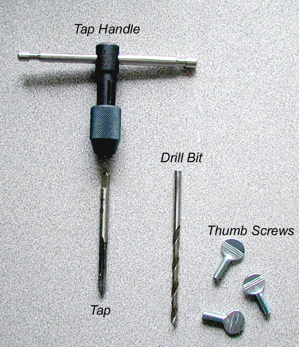
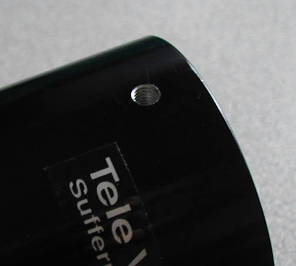

I have always been irritated that most adapters and extension tubes only come with a single set screw. This not only feels insecure when holding expensive eyepieces, but also allows excessive play burring astrophotography. I'm usually chicken about drilling into my equipment, but I finally added a second set screw to all my adapters and thought I would share my experience for anyone else who may want to do the same.

This is a simple walkthrough of how to add a second set screw to eyepiece adapter and extension tubes.

### Stuff you need
Locate some acceptable thumb screws - mine ended up being `10-32` size. The "10" is the width and the "32" is the pitch of the threads. Locate a drill bit and tap (sold as a package) which are rated at the same size as your thumb screws. I also got a tap handle (a "T" shaped device for turning the tap). The total cost should be less than $15. This assumes you already have an electric drill.

**Now for the drilling**

I placed the second set screw at 120 degrees from the original. Using the drill bit supplied with the tap drill a pilot hole in the adapter with an electric drill (be sure to make the hole perpendicular to the surface). Put the tap in the tap handle and spray a little WD40 on the tap for good luck. Slowly but deliberately screw the tap into the hole you just drilled. After a few turns back the tap out of the hole and clean out any metal bits. Reapply some WD40 and tap a little deeper this time. Repeat this until you have tapped the entire hole. That's it! After adding the second set screw all your stuff should stay secure with no wobble.

> Tip: Clay Kessler recommends white Crisco shortening for lubricating the tap instead of WD40.

> Tip: Frank Loch suggests adding a depression for an even more secure fit.

1. After drilling and tapping, insert the set screw into the tapped hole.
1. Slide the adapter (etc.) onto the object it will attach to.
1. Tighten the set screw enough to mark its spot on the object.
1. Remove the object, center punch the now visible mark, and with a slightly larger drill bit than used to drill the tapped hole, counter bore the object just a little to leave a conical depression in it. Now when you attach to the object the set screw(s) will penetrate the conical depression a bit. This will prevent the two objects from ever separating even if all the set screws become a little loose.

> Tip: Fred Lusen suggests adding a chamfer to increase the strength of the threads. Countersinks for doing this can be bought inexpensively at any hardware store. 1 to 1&frac12; threads should be relieved this way to avoid having the top thread come out at high torque, but you should leave at least 3 threads for a good grip.

*Note: If anyone has any more suggestions or a better technique please let me know.*

