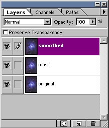
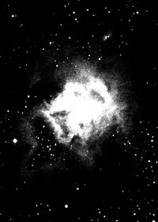
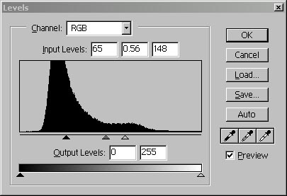
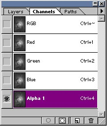

**Update**: I now use Noise Ninja for all my noise reduction. It works really well.

### Using Photoshop

*Adapted from a paper by mwcook@cris.com*

The idea behind this method is that the low-light areas of the photograph need to be smoothed in order to remove grain artifacts while the bright stars and nebulosity should remain unchanged. To achieve this in Photoshop you need to construct a mask for the Gausian Blur filter. This mask should hide the bright parts of the image, while exposing the grainy parts to the blur filter. Please read the notes at the bottom of the page.

I have created an action which includes all of these steps which you can download. Click here to download. To use it just open up the Actions window, click on the arrow in the upper right of the window and select Load actions. Pick the file you just downloaded and you should see a new button entitled "Reduce Film Grain" at the bottom of the Actions window. One of the keys to using Photoshop effectively is learning how to make and use actions.

Image by Tony Hallas used with permission

Load your original image into Photoshop

Copy the background layer twice and rename your layers in ascending order "original", "mask", and "smoothed".

Turn the visibility off for the "smoothed" layer (click on "eye" icon).

Make sure you have the mask layer selected and press `Shift-Ctrl-U` to desaturate the image.

Press `Ctrl-L` to adjust the levels, play around with the histogram sliders until you get an image which is white where the stars and bright nebulosity is (i.e. where there is no grain) and black where there is grain. You don't need to create a black and white image, try to include at least a little grey area in between (b).

Press `Ctrl-A` to select everything in the layer.
Press `Ctrl-C` to copy selection.
Select the Channel dialog and create a new channel, called "Alpha 1".
Select this channel and press `Ctrl-V` to paste the mask into it.
Click on the RGB channel.

1. Now we are going to apply a blur to the grainy parts of the image while masking the non-grainy parts.
1. Select the "Smoothed" layer and make sure it's visible
1. Choose `Selection->LoadSelection`
1. Choose the "Alpha 1" channel and make sure Invert is checked.
1. Press `Ctrl-H` to hide the marching ants (note: you still have an active selection!)
1. Choose either `Filter->GausianBlur` of `Filter->SmartBlur` and blur away (a).
1. Lather, and repeat if necessary.

### Notes

(a) It may be necessary to feather the selection (Alt-Ctrl-D) before performing the blur so the edges of stars do not get blurred out with the grain. This is not easy to do interactively in Photoshop.

(b) This method is very sensitive to the mask provided. Any dim stars will be blurred away if the mask is not carefully built. Make sure the mask is white over any stars you wish to keep from being blurred.

(c) If the image contains grain in a specific set of color ranges you can use Select->ColorRange to select the grainy parts instead of step 3. This is less helpful when your image contains lots of colors, but works very well otherwise.

