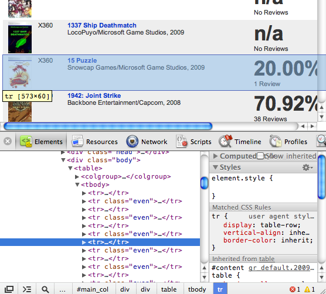

### Scraping Data

All of the data used to build these visualizations was extracted from various web sites using a few [Python](http://www.python.org) scripts.  The [Beautiful Soup](http://www.crummy.com/software/BeautifulSoup) library was used to parse and traverse the HTML.

Google Chrome's developer tools are an excellent way to discover the structure of a web site so it can be traversed quickly with scripts.




Scraping data from web pages is easy as long as you completely ignore the impulse to follow good coding practices.  Don't feel bad about going gangbusters with [Law of Demeter](http://en.wikipedia.org/wiki/Law_of_Demeter) violations - if the layout changes you'll probably have to rewrite it anyway.

```python
f = urllib.urlopen("www.seansdatagoldmine.com");
s = f.read()
f.close()
soup = BeautifulSoup(s)
chartDiv = soup.find("div", { "id" : "chart_body" } )
chartTable = chartDiv.findAll(name="table",recursive=False)
scoreValue = chartTable[3].findAll("span")[0].findAll("b")[0].text
```

Sometimes a simple text editor with regular expression features make things easy.  Visual Studio's search/replace is great for cleaning up data.

### Data Layout and Format
Most tabular data on the web is in some sort of "pivot" format.  That is, it's got more than one measure per row.  Tableau (and most database operations) work best when data is organized with a single measure per row.  This usually means un-pivoting the data in either the web scraping scripts or abusing [Excel's PivotTable](http://spreadsheetpage.com/index.php/tip/creating_a_database_table_from_a_summary_table) feature.

All of the data produced for this series was stored in multiple tab-delimited text files.  There was no need to import them into a database as Tableau can do join operations across text files.

### Visualization and Presentation

[Tableau Desktop](http://www.tableausoftware.com) was used to explore the data and arrive at the most interesting details that were worth publishing. The workbook and data extracts were uploaded to [Tableau Public](http://www.tableausoftware.com/products/public) so they could be embedded into posts.

### Analysis

Mathematica was used to match distributions, but nothing interesting came out of it so the results aren't included.
