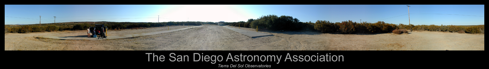
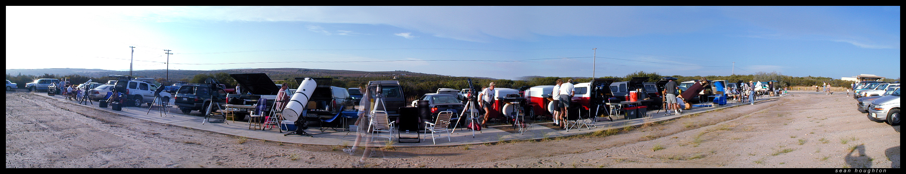
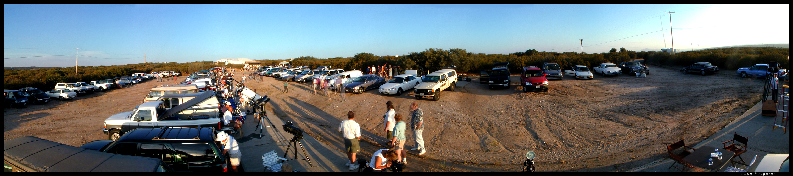

I don't have my own observatory so I use the <a href="http://www.sdaa.org">San Diego Astronomy Association</a>'s dark sky site in Tierra Del Sol most of the time. The following are some pictures of Tierra Del Sol at various levels of activity.

 
These are some pictures taken durring the SDAA yearly barbeque.

