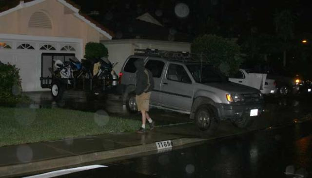
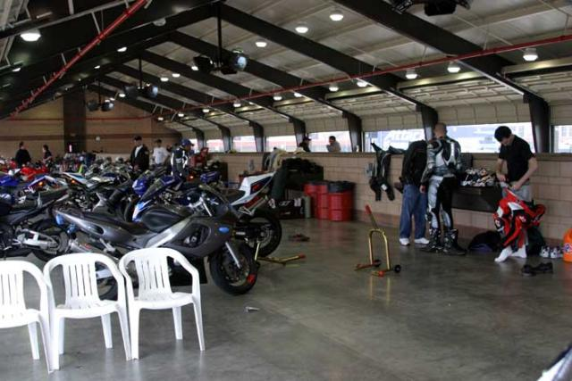
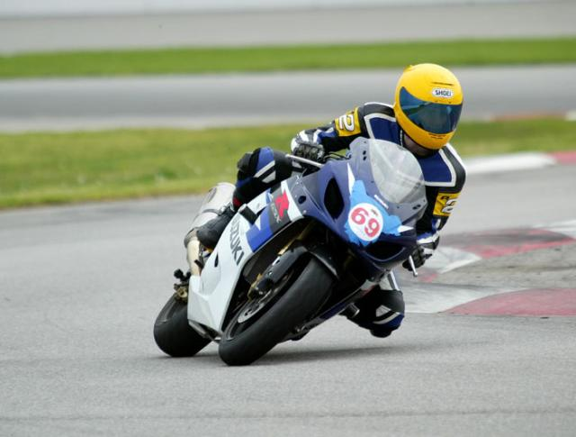
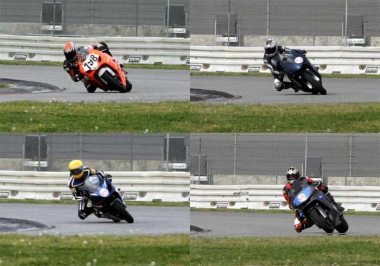
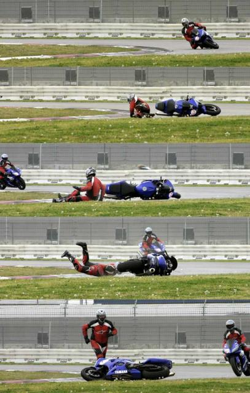

### Preparation

The biggest pain in the ass part of a trackday is getting everyone's bikes and equipement into and onto the trailer.  Last time we went I rented a UHaul trailer and my ramp was about 3 inches wide.  This time one of the guys at work loaned us his trailer which made things **much** easier.  Joel (dark blue CBR600) helped load the trailer while I stayed at work until 9pm trying to fix one last bug in the game we're working on.  True to form, Stephane (grey YZF600) let us do all the work.

It rained all week, and was raining when we left at 5:30 in the morning on Sunday.  The forecast said it should have cleared up the day before, so this was a bad sign.  The Saturday trackday had been completely rained out.

As we drove in it started to clear up and by the time we got there the rain had quit and the track was completely dry.  That is serious luck.  It started raining again the next day.

### First Impression

This trackday was not like our previous one at Streets of Willow.  This was like going to a race, only you're the one on the track and in the paddocks.  There were trailers from Dunlop, Attack Kawasaki and all sorts of other sponsors.  There were some AMA guys there for last minute practice before the first race of the season in Daytona.  The rest of the place was **packed** with motorcycles and people.  The track has rows of garages that are filled with racecars on normal race days, but today they were filled with what seemed like hundreds of superbikes.

### First Session

I was not at all comfortable on the bike for the first session.  The guys running the show lead everyone on a sighting lap to get acquainted with the lay of the land and to make sure all the bikes were in working order.  It took the entire session to really start feeling confident again.   Joel and Stephane seemed in better shape then me.  Note to self: //get more sleep//.

### Gaining Speed

While I never really got as comfortable in the turns as I was at SoW I felt like I really improved my braking and shifting.  I was pushing deeper and deeper into the corners as the day went on.  What seemed like a bus stop chicane following the long straight eventually became some slight leaning at near top speed.  The aproach to the set of esses before coming around for another lap was a great place for passing on the brakes and this is where I usually caught up with Stephane after he gained some distance in the corners.

### Room for Improvement

The best/worst thing about doing a trackday is realizing how much you suck.  Although I can probably ride faster then 90% of the street-only sportbike owners, I look like a beginner on the track.  It's really educational to compare pictures of yourself and other, better riders.  Video would have been better, but that's for next time!

### Photos

I brought my 10D digital SLR to the track so our guest Scott could take some pictures of anything that caught his fancy.  I had enough memory for about 800 pictures and fully expected 700 of those to be women's asses when I downloaded the pictures.  However, Scott came through and took 650 pictures, most of which are motorcycles.  He even caught some crashes!

It's getting late, so I'll leave it at that for now.  More photos to come.

