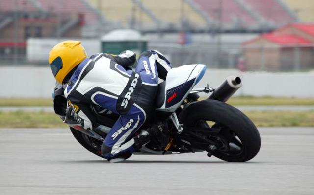
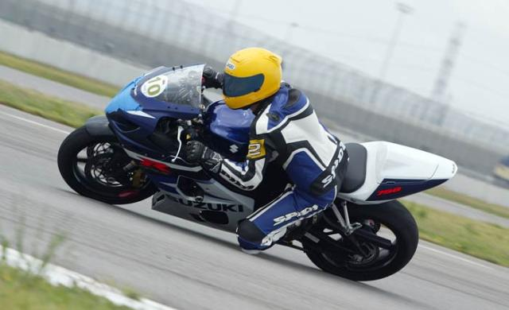
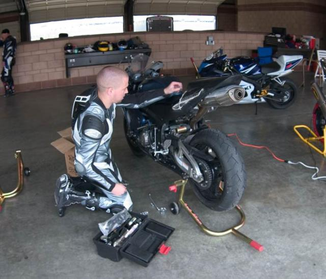
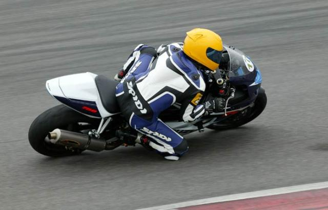
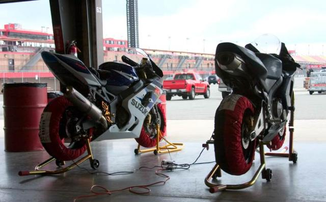
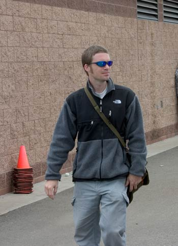
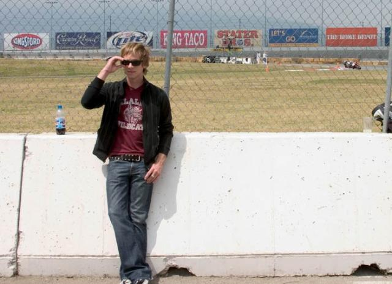

Another track day!

This is the 3rd trackday I've been to at the Speedway in Fontana.  The first time was really just to get to know the track.  By the end of the day we were doing laptimes that placed us in the intermediate group; so that's the group we've been riding with the last two times.

Get your suspension tuned by someoe (I had mine done by RaceTech).  It only takes about 20 minutes.  I still had the stock settings and they were WAY off.  In the first session I did after having them rework the front end I had my knee on the ground in nearly all the slow to medium speed turns.  The front had been diving when I turned in and then "bouncing" back while leaned over - weak!  It really killed my confidence.  As Kieth Code would say: my SR was to roll off the throttle which used about $8 of attention and caused me to loose the product of the turn I was aiming for which angered the Thetans in my soul.

### At Least I Didn't Crash

Joel crashed on the second lap of the first session!  He says he hit his knee on the rumble strip which bounced up and hit his tank.  That caused him to loose the front and lowside.  He's got a pretty good knee-shaped dent in his gas tank and tank colored paint on his leathers.  He managed to repair his bike before the next session.  All his bitching about how nobody else comes prepared to fix damage seems to be well founded.

Stephane is still a madman on the track and has so far managed to crash his new GSXR each of the three times he's used it - twice on the track and once on the street.  He crashed after the 3rd session and left so I don't have any pictures of him.

### The 2005 AMA Race

I went to the AMA race with my brother the next weekend.  I'll fill more in later.  Not many pictures taken.

