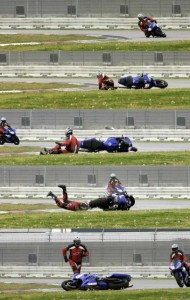
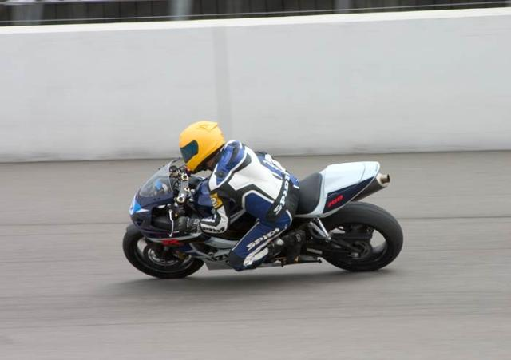
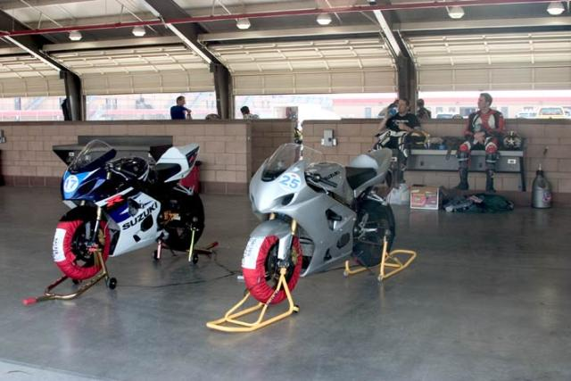
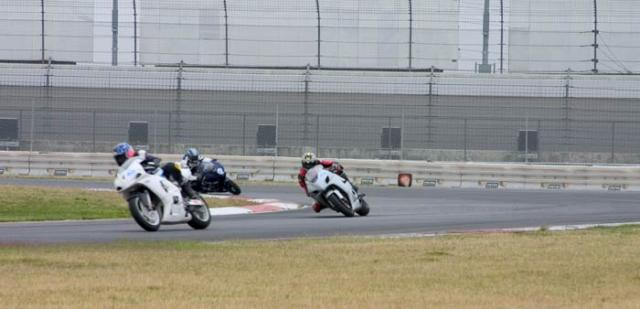
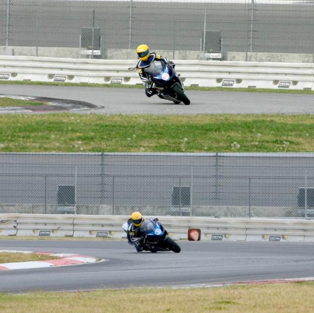
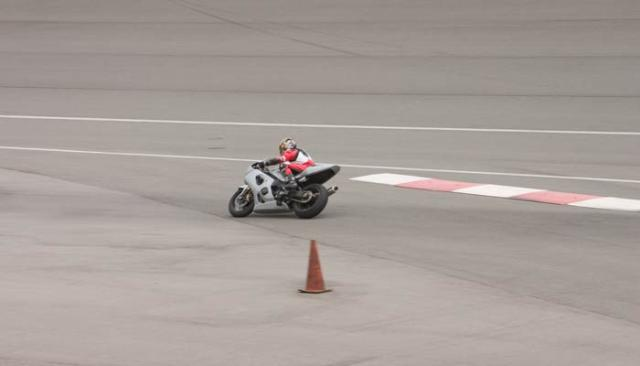

Just finished another track day at California Speedway in Fontana with Stephane.  This was the fourth track day we've done at this track.

Here's my favorite crash sequence - gotta love the legs in the second to last panel - ouch!

### The Speedway

### New Tires

I ditched my Perelli Diablos for some new Dunlop 208 GPs.  They seem to have a more predictable sliding, but slide more often.  They also shed rubber like crazy.  It looks like I have completely destroyed the tire after each session.  Strange.

### Goals

Stephane was trying to beat his 3.5 session limit before crashing.  He focused on not braking into turns (late braking) and it paid off.  He managed to make it through all eight sessions.

I mostly worked on hooking corners together and passing.  I have even more respect for the pros after watching them pass in races.  It's hard.  I put together a shot from my first track day at Fontana and this one for comparison.  I still have trouble with turn 9, but I think I'm getting better at it.

### Endurance

We both rode in all 8 sessions.  I decided to stop a little early in the 7th session because there was a huge crowd in front of me and my clutch hand was having some issues.  I got back in for the last session and did the whole thing.

### Crashes

I saw many, many people go off track.  One guy crashed on cold tires right in front of me and went for a tumble in turn 4.  Last time I gave Scott my camera at a trackday he came back with 600 pictures.  This time he filled up my 2GB memory card after 4 sessions.

