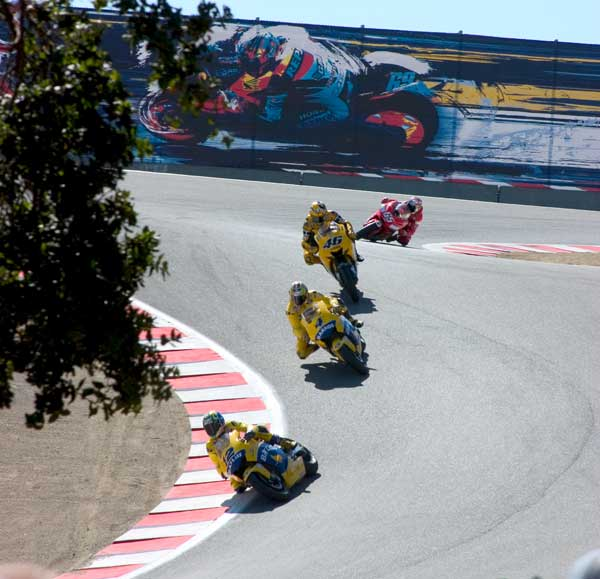
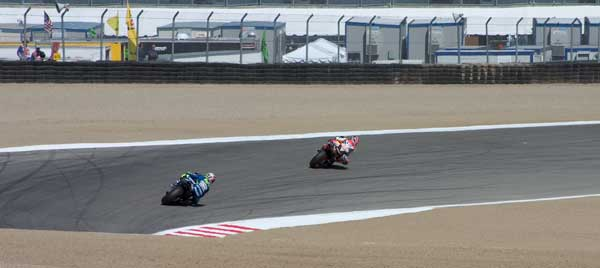
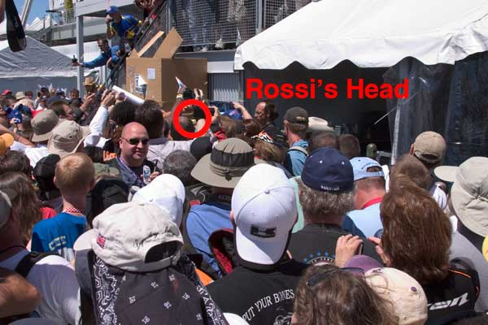
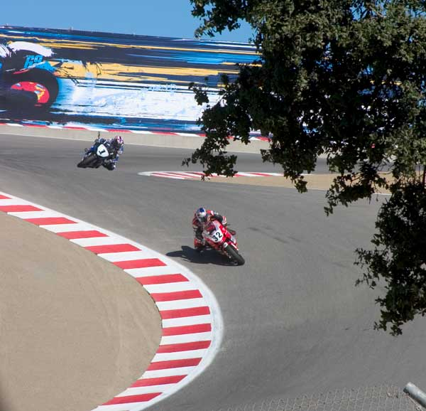
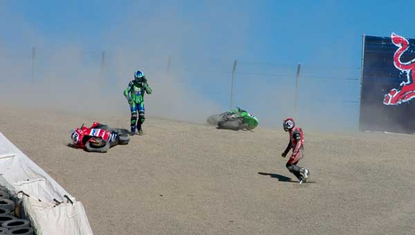
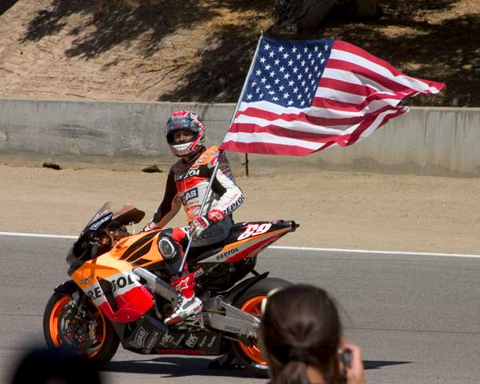

I just got back from the MotoGP race in Monterey!  These machines sound nothing like any race bike you've ever heard.

The first time I saw the MotoGP bikes drop down into the Corkscrew for practice on Saturday they were louder, brighter, more colorful and just plain more impressive than anything I expected.

I had a pit pass but didn't really make much use of it.  I watched the Ducati bike do some engine revving and thought I might get a peek at Rossi in person, but that was a silly idea.  After almost getting run over by shifter carts we decided to ditch the paddock and get some lunch.

The last event on Saturday was the AMA Superbike race.  It was a great race because Bostrom was leading and the crowd was really into it.

Hayes took out Hodgson right in front of us on the first lap.  The battle between Spies and Yates was fun to watch - seems like they were swapping almost every other lap.

The coolest part of the weekend was probably being in the cheering crowd at the corkscrew and having Rossi and Edwards doing burnouts and then having Nicky Hayden stop and entertain the crowd right in front of us after winning the race.

