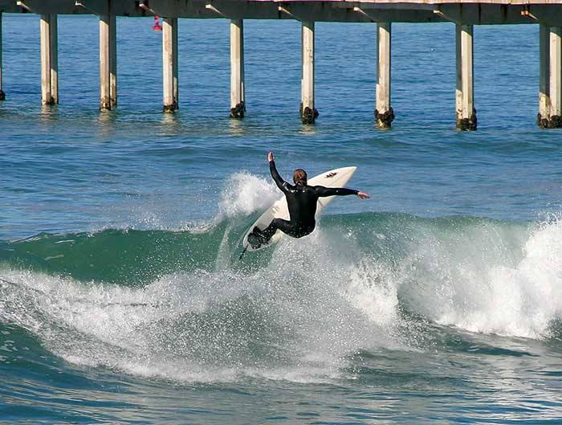
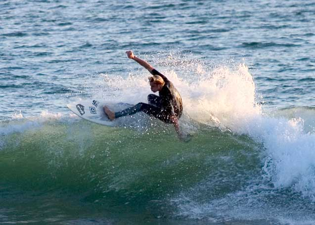
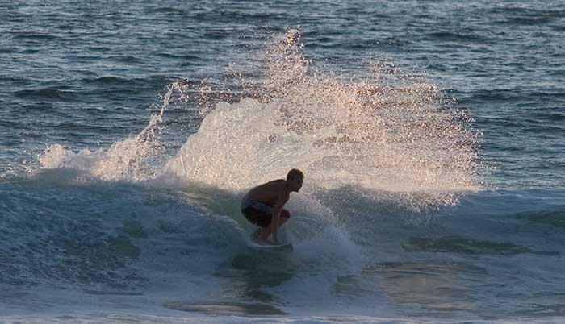
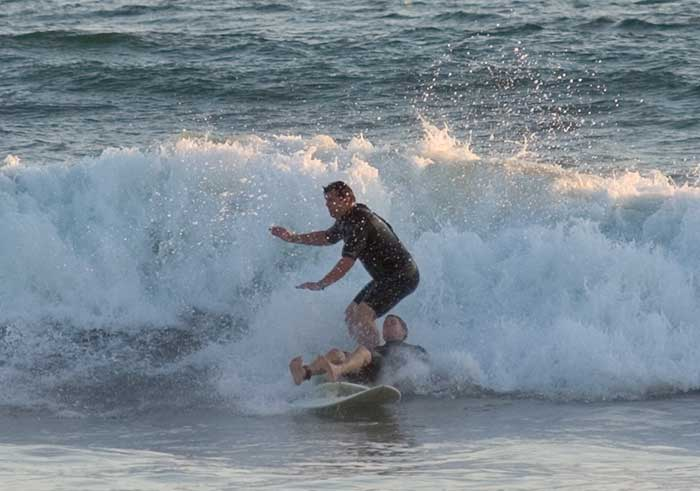
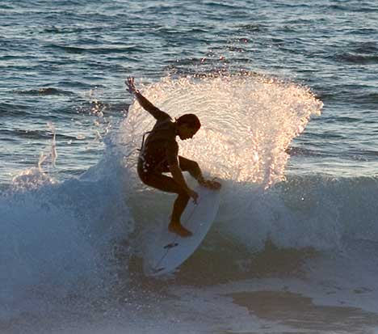
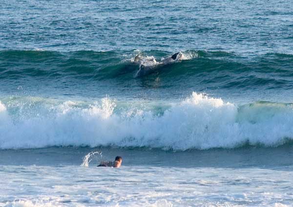
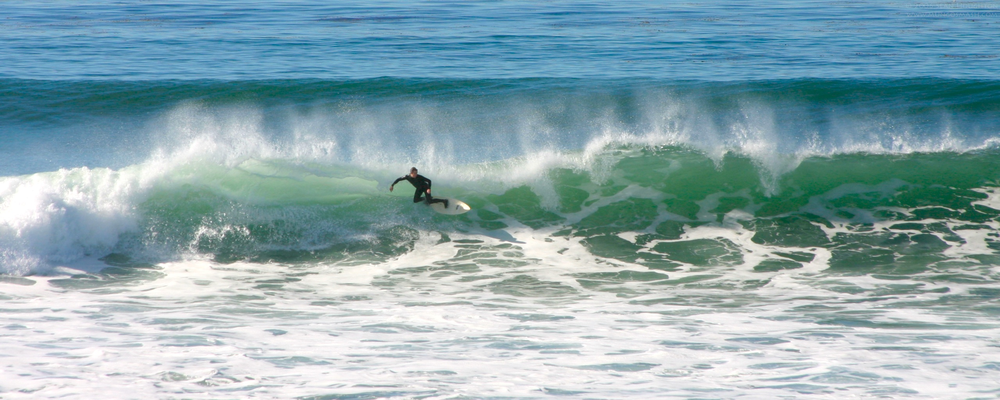

I managed to injure my ankle and get pretty sick right when a large swell showed up in San Diego.  The weather was awesome so all I could get was vicarious surfage.

### The Ocean Beach Pier

I've never surfed here.  It looks like a narrow break with some nasty rocks and pier poles to watch out for.

### Sunset Cliffs

This place was crowded.  There were tons of surfers and even more sightseers.  There was a distant break where most of the longboarders were, and a beach break with these shortboards.

