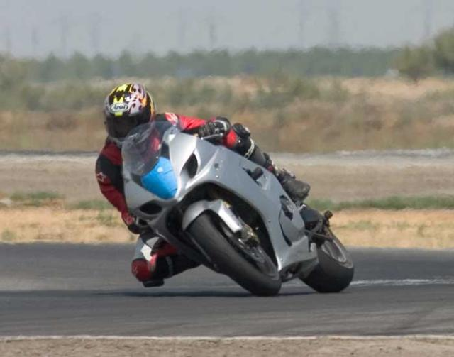
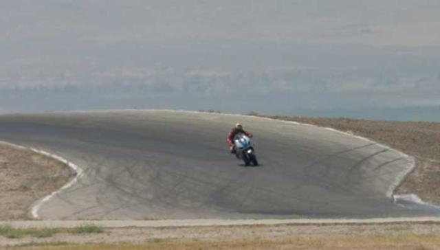
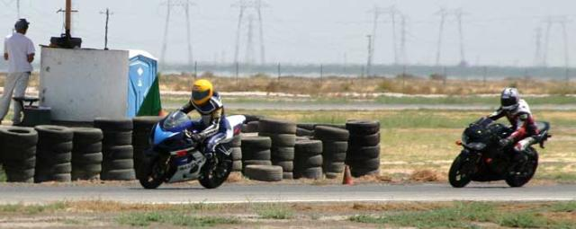
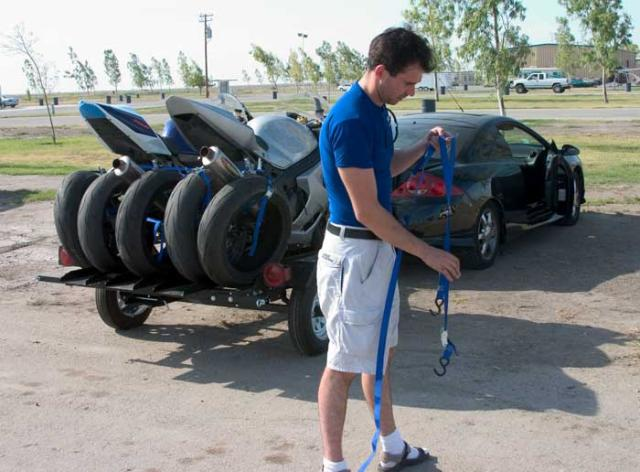

Stephane and I did a two day trackday at Buttonwillow.  It was between 95 and 100 degrees most of the day, but going for two days was an interesting experience.

We drove up Friday night and got to Buttonwillow at around 1am in the morning.  The hotel screwed up our reservation but made good by giving us two rooms for the night.

The first day was tough.  It took a while to get used the heat and I had never been on the track before.  My laptimes for the first few sessions averaged around 2:30.  By the end of the day I had managed to get down to around 2:15 and feel pretty comfortable with the track.  I still hadn't figured out the corners and I wasn't hitting all my turn in points as well as I would have liked.

On the second day it was cooler out and there were about half as many people.  The organizers decided to hold a vote and we ended up doing an open session all day.  I'd never done an open session trackday and I was a little worried about getting passed at high velocity by the race guys.  It turned out that I was fast enough to only be passed a couple times the entire day - mosty because of the lack of people.  The one guy who did pass me at warp speed (doing a wheelie) crashed the next session.

I started the day right out in the 2:15 range and started working on being really consistent with what I was doing on the track.  While Stephane took off to get some cash for his tire collection (see the last picture) I managed to stay out on the track for 16 laps and was pleased to find that I had done a consistent set of 2:12s and one 2:11 - my best time of the weekend.

It started getting hot out and for the rest of the day I slowed down a few seconds and kept focusing on my lines and forcing myself not to brake before a couple of the high speed turns like the Bus Stop and the following hill.

I should mention that I didn't go off the track once while Stephane managed to do it more times than I can remember.  I even managed to get a picture of him going off track in the 10 minutes I took pictures the first day.

