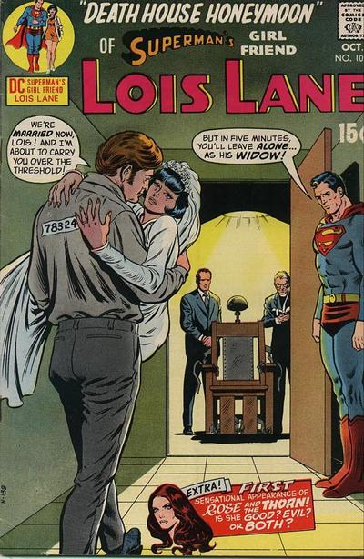

I just saw the new movie Superman Returns and I'm not sure but I might be missing the intended point.  I kept seeing Superman as a symbol of men's insecurity.  He's your wife or girlfriend's ex-boyfriend and you're pretty sure she's still in love with him.  He's better looking, stronger and he won't stay away.

Lex Luthor, on the other hand, is just like you and I.  He's balding, has crap friends and just wants a bit of land to call his own without Superman coming around to mess it all up.

The movie forces me to ask the question: "why do we need Superman anyway?"  We don't, he sucks.

